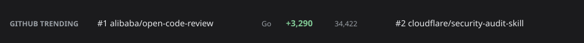

# Backstage Plugin GitHub Trending

[](https://www.npmjs.com/package/@aag1999/plugin-github-trending)
[](https://github.com/AAG1999/backstage-plugin-github-trending/blob/main/LICENSE)
[](https://github.com/AAG1999/backstage-plugin-github-trending/actions/workflows/ci.yml)

A Backstage homepage ticker widget that shows [GitHub Trending](https://github.com/trending) repositories as a stock-market or news-channel crawl.



## Features

- **Dynamic Crawl**: Displays trending repositories with smooth, adjustable scrolling.
- **Customizable Filtering**: Filter trends by spoken language, programming language, and time period (daily, weekly, monthly).
- **Backend Caching**: Includes a companion backend plugin that safely scrapes and caches GitHub Trending data (default 45 minutes) to respect GitHub's [Acceptable Use Policies](https://docs.github.com/en/site-policy/acceptable-use-policies/github-acceptable-use-policies) and avoid rate-limiting.
- **Accessible**: Supports screen readers with a static list fallback. The animation pauses on hover or through a visible Pause control (WCAG 2.2.2), and respects `prefers-reduced-motion`.

## Packages

This repository is a monorepo containing the following packages:

| Package | Role |
| --- | --- |
| `@aag1999/plugin-github-trending` | Frontend ticker widget component |
| `@aag1999/plugin-github-trending-backend` | Backend cached fetch and JSON API |
| `@aag1999/plugin-github-trending-common` | Shared types across frontend and backend |

## Prerequisites

- Backstage application
- Node.js 22 or 24

## Installation

### 1. Backend Setup

First, install the backend package into your Backstage backend workspace.

```bash
yarn workspace backend add @aag1999/plugin-github-trending-backend
```

**New Backend System**
Register the plugin in your backend's `index.ts`:

```ts
// packages/backend/src/index.ts
backend.add(import('@aag1999/plugin-github-trending-backend'));
```

### 2. Frontend Setup

Next, install the frontend package into your Backstage app workspace.

```bash
yarn workspace app add @aag1999/plugin-github-trending
```

**New Frontend System**

Register the plugin feature in your `App.tsx` or `index.ts`:

```ts
// packages/app/src/App.tsx
import githubTrendingPlugin from '@aag1999/plugin-github-trending/alpha';

createApp({
  features: [githubTrendingPlugin],
});
```

Then, you can place it in your `app-config.yaml` as an extension:

```yaml
app:
  extensions:
    - home-page-widget:github-trending/ticker:
        config:
          since: weekly
          language: go
          maxItems: 15
          pixelsPerSecond: 50
          refreshIntervalMinutes: 15
          showSpotlight: true
```

**Old Frontend System**

Register the plugin and mount the widget as a child of your `CustomHomepageGrid`.

```tsx
// packages/app/src/App.tsx
import { githubTrendingPlugin, HomePageGithubTrendingTicker } from '@aag1999/plugin-github-trending';

createApp({
  plugins: [githubTrendingPlugin],
  // ...
});

// Inside your custom homepage layout:
<CustomHomepageGrid>
  <HomePageGithubTrendingTicker />
  {/* other widgets */}
</CustomHomepageGrid>
```

You can customize the widget by passing props:

```tsx
<HomePageGithubTrendingTicker since="weekly" language="go" maxItems={15} />
```

## Configuration

Both frontend props (for the old frontend system) and YAML configurations (for the new frontend system) support the same properties. Below are the available properties:

| Property | Default | Purpose |
| --- | --- | --- |
| `since` | From backend config | `daily` \| `weekly` \| `monthly` |
| `language` | All | Programming language filter, e.g. `typescript` |
| `spokenLanguageCode` | All | Spoken language filter, e.g. `en` |
| `maxItems` | All returned | Cap the number of repositories shown |
| `pixelsPerSecond` | `50` | Scroll speed; readable range ~30–80, >100 is unreadable |
| `refreshIntervalMinutes` | `15` | Re-fetch cadence; `0` disables polling |
| `showSpotlight` | `true` | Static rotating feature row (with description) under the crawl |

You must also configure the backend in your `app-config.yaml`:

```yaml
githubTrending:
  # Public github.com — GHES has no /trending page
  baseUrl: https://github.com
  since: daily          # default fallback for since (daily | weekly | monthly)
  # language: typescript
  # spokenLanguageCode: en
  cacheTtlMinutes: 45
```

## Contributing

We welcome contributions! Please see [CONTRIBUTING.md](CONTRIBUTING.md) for guidelines on local development, building the project, and submitting changes.

## Directory Listing

If you are a Backstage maintainer and the packages are on the public npm registry, add [`docs/plugin-directory.yaml`](docs/plugin-directory.yaml) to the official Backstage [microsite plugin directory](https://backstage.io/docs/plugins/add-to-directory/).
